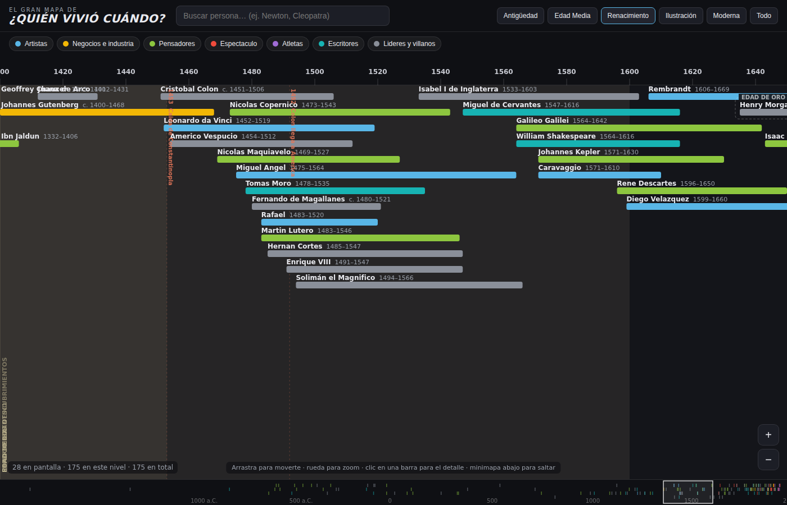

# ¿Quién vivió cuándo?

Una línea de tiempo **interactiva** de la historia humana, desde que hay
registros (~1800 a.C.) hasta hoy. Inspirada en el póster *"The Big Map of Who
Lived When?"*, pero pensada para escalar a **muchísima gente** sin volverse
ilegible.



## El concepto

El reto no es dibujar 50 personas: es dibujar **miles** y que siga siendo
navegable. La solución se apoya en tres ideas:

1. **Render sobre Canvas + culling.** No se crea un elemento DOM por persona
   (eso mata al navegador con miles de barras). Todo se pinta en un `<canvas>`
   y solo se dibuja lo que cae dentro de la ventana visible.

2. **Nivel de detalle (LOD) por notoriedad.** Cada persona tiene un `tier`
   (1 = icónica, 4 = de nicho). Con todo el rango a la vista solo aparecen los
   `tier 1`; al hacer **zoom** van apareciendo los tiers inferiores. Así la
   densidad en pantalla es siempre legible, haya 100 o 100.000 personas.

3. **Empaquetado en carriles (lane packing).** Las barras se reparten en filas
   evitando solapes, reservando hueco para la etiqueta.

Sobre esa base se reproduce la "lógica" del póster original:

- **Barra** por persona: nombre + rango de vida (`c.` cuando es aproximado),
  coloreada por categoría.
- **Franjas de era** de fondo (Antigüedad, Edad Media, Renacimiento…).
- **Eventos puntuales** (Colón 1492, Luna 1969, Crack de 1929…).
- **Cajas temáticas** que agrupan personas (Edad de Oro de la Piratería,
  Padres fundadores, Filósofos griegos…).
- **Conectores de relación** entre personas (maestro de, rivales, amigos…).

## Interacción

- **Arrastrar** para desplazarte (tiempo y verticalmente).
- **Rueda del ratón** para hacer zoom (mantén *Shift* para desplazar vertical).
- **Clic** en una barra abre su ficha de detalle.
- **Buscador** con autocompletado: selecciona y salta a esa persona.
- **Filtros** de categoría (leyenda) para encender/apagar grupos.
- **Presets** de época (Antigüedad, Edad Media, Renacimiento…).
- **Minimapa** inferior: densidad de personas + rectángulo de la vista actual;
  haz clic para saltar a cualquier punto de 4000 años.

## Cómo ejecutarlo

Es un sitio **estático sin dependencias ni build**. Basta abrir `index.html`
en el navegador (funciona incluso con `file://`, porque los datos se cargan
como scripts en lugar de por `fetch`).

O sírvelo con cualquier servidor estático:

```bash
python3 -m http.server 8000
# luego abre http://localhost:8000
```

## Estructura

```
index.html          Estructura y controles de la UI
css/styles.css      Estilos (tema oscuro)
js/timeline.js      Motor de render (canvas, LOD, packing, capas)
data/people.js      Dataset de personas  ← aquí se añade gente
data/context.js     Eras, eventos, cajas temáticas y relaciones
```

## Cómo añadir personas

Añade una entrada a `data/people.js`:

```js
{ name: "Nombre", cat: "thinkers", b: 1452, d: 1519,
  tier: 1, region: "Italia", note: "Una línea de contexto",
  role: "inventor", approx: false }
```

- `cat`: una de `artists · business · thinkers · entertainers · athletes ·
  writers · leaders`.
- `b` / `d`: año de nacimiento / muerte (negativo = a.C.; `d: null` = sigue
  viva).
- `tier`: 1 (siempre visible) … 4 (solo con mucho zoom).
- `role` / `approx` son opcionales.

## Próximos pasos (escalar de verdad)

- Importar en masa desde **Wikidata** (fecha de nacimiento/muerte, ocupación,
  Sitelinks como proxy de notoriedad para asignar `tier` automáticamente).
- Cargar los datos por *chunks* según el rango/zoom visible.
- Índice espacial (por año) para el hit-test cuando haya decenas de miles.
- Compartir vista por URL (rango + persona seleccionada).
